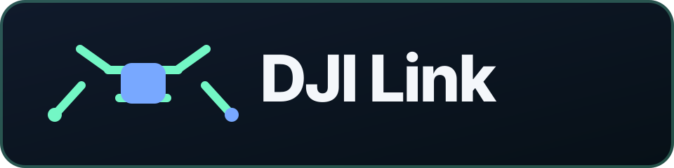
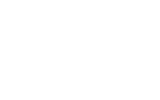

# DJI Link

<p align="center"></p>
<p align="center">
  <a></a>
  <a></a>
  <a></a>
  <a></a>
</p>

- **Project site:** https://dream-catcher-project.ru/
- **Downloads:** https://dream-catcher-project.ru/downloads
- **Documentation:** https://dream-catcher-project.ru/docs
- **Contribute:** https://dream-catcher-project.ru/contribute

**Fly a DJI Mavic Mini 1 (WM160) from your computer** — live video, telemetry, and full flight control from a native Windows/Linux/macOS app, without the phone app. A Raspberry Pi acts as a small bridge to the remote controller; the PC does everything else.

There is no official desktop SDK for the Mini 1, so DJI Link is built directly on the drone's own **DUML** protocol, reverse-engineered from the DJI Fly app.

> ⚠️ Unofficial project, not affiliated with DJI. Use at your own risk — see [Disclaimer](#disclaimer). For your own hardware only.

# DEMO

Add the finished GIF as `docs/demo.gif`, then uncomment the image line below:

<!-- Add docs/demo.gif after recording. Keep it short (10–20 seconds) and show the
     preflight screen, live HUD/telemetry, and one safe control interaction. -->
<!--  -->

Until then, the simulator can open the same interface without aircraft hardware:

```bash
dji-link --sim --windowed
```

See [`docs/DEMO.md`](docs/DEMO.md) for the recording checklist.

---
## Features

- **Live video** from the drone (H.265/HEVC), decoded into the app window.
- **Telemetry** — attitude, altitude, speed, battery, flight mode, home flag, and plain-language reasons when the motors refuse to start (decoded diagnostic tables).
- **Flight control** — takeoff, land, return-to-home, arm/disarm, and continuous **virtual-stick flight** (hardware-verified: `0x03/0x8E` DataFlycJoystick; spectator-style — mouse to look/turn, WASD to move, Space/Shift for throttle). Control auto-enables once the takeoff settles, and hands back to the remote on release. Flight modes Cine/Normal/Sport.
- **Gimbal & camera** — tilt with the mouse, photo, record (R toggles), zoom, ISO/shutter/EV.
- **Settings panel** (Esc) — max altitude and distance (up to the drone's 500 m ceiling, no unlock needed), RTH altitude, home-to-current, exposure, camera mode.
- **Console** — run native flight/gimbal/camera/raw DUML commands from the GUI or `--console`, with media commands intentionally left out until that path is finished.
- **Zero-config launch** — the installed `dji-link` app finds the Pi, connects, and walks you through powering on the link.
---
## How it works

```
[ PC — the brain, C++ app ] --Wi-Fi-->  [ Pi — dumb bridge ]  --USB-->  [ remote ]  )))  [ drone ]
   video · telemetry · control                (forwards bytes)
```

The drone and remote talk over DUML, and the phone app connects to the remote as a USB **accessory** (Android Open Accessory). A normal PC can only be a USB *host*, so it can't pose as that accessory — a Raspberry Pi can. The Pi presents itself to the remote as the phone and forwards the raw byte stream to the PC over Wi-Fi. All protocol handling — DUML framing, the composite AOA mux, video reassembly, control — happens on the PC.

Full protocol write-up: **[`dji_link_beta/reverse_docs/`](dji_link_beta/reverse_docs/)** (`MASTER_REPORT.md`, `FLIGHT_GATING.md`, `ERROR_CODES.md`, telemetry and command tables).

---
## Hardware

| Part | Requirement |
|------|-------------|
| Drone | DJI Mavic Mini 1 (WM160), already activated once with the official app |
| Remote | The Mavic Mini remote controller |
| Bridge | Raspberry Pi **Zero 2 W** (any Pi with USB OTG / `dwc2` peripheral mode works) |
| SD card | ≥ 8 GB (16 GB recommended), Raspberry Pi OS (Bookworm, 64-bit) |
| Cables | A **data** USB cable from the Pi's USB port to the remote (the phone cable); separate power for the Pi |
| PC | Windows 10/11, Linux, or macOS |

The Pi only forwards bytes, so 512 MB RAM (the Zero 2 W) is plenty.

---
## Install

### PC

Download the native installer for your OS from GitHub Releases:

Latest release page:
`https://github.com/Kolya080808/DJI-Link/releases/latest`

Direct latest installers:

| Platform | Installer |
|----------|-----------|
| Windows x64 | `https://github.com/Kolya080808/DJI-Link/releases/latest/download/dji-link-windows-x64.msi` |
| Windows x86 | `https://github.com/Kolya080808/DJI-Link/releases/latest/download/dji-link-windows-x86.msi` |
| Windows arm64 | `https://github.com/Kolya080808/DJI-Link/releases/latest/download/dji-link-windows-arm64.msi` |
| macOS Apple Silicon | `https://github.com/Kolya080808/DJI-Link/releases/latest/download/dji-link-macos-arm64.dmg` |
| macOS Intel | `https://github.com/Kolya080808/DJI-Link/releases/latest/download/dji-link-macos-x86_64.dmg` |
| Linux x86_64 `.deb` | `https://github.com/Kolya080808/DJI-Link/releases/latest/download/dji-link-linux-x86_64.deb` |
| Linux arm64 `.deb` | `https://github.com/Kolya080808/DJI-Link/releases/latest/download/dji-link-linux-arm64.deb` |
| Linux x86_64 `.rpm` | `https://github.com/Kolya080808/DJI-Link/releases/latest/download/dji-link-linux-x86_64.rpm` |
| Linux arm64 `.rpm` | `https://github.com/Kolya080808/DJI-Link/releases/latest/download/dji-link-linux-arm64.rpm` |

Portable latest archives:
- Windows x64: https://github.com/Kolya080808/DJI-Link/releases/latest/download/dji-link-windows-x64.zip
- macOS Apple Silicon: https://github.com/Kolya080808/DJI-Link/releases/latest/download/dji-link-macos-arm64.tar.gz
- macOS Intel: https://github.com/Kolya080808/DJI-Link/releases/latest/download/dji-link-macos-x86_64.tar.gz
- Linux x86_64: https://github.com/Kolya080808/DJI-Link/releases/latest/download/dji-link-linux-x86_64.tar.gz
- Linux arm64: https://github.com/Kolya080808/DJI-Link/releases/latest/download/dji-link-linux-arm64.tar.gz

Live video needs `ffmpeg`, and release packages bundle it at package time:

- Windows `.msi` includes `ffmpeg.exe` in the installed app directory.
- macOS `.dmg` includes an architecture-matching `ffmpeg` inside the `.app` bundle.
- Linux `.deb` / `.rpm` / `.tar.gz` include a static `ffmpeg` binary in `bin/`.

The app itself never installs dependencies at runtime. Portable release archives include the same bundled `ffmpeg`; local developer builds can also use `ffmpeg` from `PATH`.

### Raspberry Pi

Flash Raspberry Pi OS, enable SSH, then run the latest release installer on the Pi:

```bash
curl -fsSL https://github.com/Kolya080808/DJI-Link/releases/latest/download/install-pi.sh | sudo bash
```

The installer downloads `dji-link-pi.tar.gz` from the same latest release, installs `dwc2`, `raw_gadget`, `dji-ap.service` (the Wi-Fi access point), `dji-netctl.service`, `dji-bridge.service`, and `dji-update.timer`. If the Pi has internet, the timer checks GitHub Releases and updates the Pi bundle automatically. A first-time install may require one reboot, then services start by themselves on every power-up.

`dji-netctl.service` exposes discovery/Wi-Fi control on `:9911`; `dji-bridge.service` exposes the flight data path on `:9910`. The bridge service opens `:9910` as soon as it starts and retries AOA/UDC setup in the background, so the PC can reach the flying endpoint even while the remote controller is still being plugged in. Bridge logs are in `journalctl -u dji-bridge` and `/var/log/dji-link/bridge.log` on the Pi.

If the Pi ends up with no network at all and no access point, see [`dji_link_beta/pi/README.md`](dji_link_beta/pi/README.md#rescue-the-pi-is-not-reachable-at-all) — `rescue.sh` repairs it, including straight off the SD card with no console attached.

Direct latest assets:
- `https://github.com/Kolya080808/DJI-Link/releases/latest/download/install-pi.sh`
- `https://github.com/Kolya080808/DJI-Link/releases/latest/download/dji-link-pi.tar.gz`

---
## Usage

On the PC, with the Pi powered and the drone + remote on, launch the installed app:

```bash
dji-link              # GUI: menu -> discovery -> flight window
dji-link --sim        # no hardware — try the interface
dji-link --console    # headless console client
```

### Controls

| Input | Action |
|-------|--------|
| Mouse | Look / turn (yaw) and tilt the gimbal — spectator style |
| W A S D | Forward / left / back / right |
| Space / Shift | Up / down (throttle) |
| Enter | Arm / disarm |
| T / L / H | Takeoff / land / return-to-home |
| P / R | Photo / record |
| K / U | Request keyframe / send no-GPS takeoff unlock |
| Esc | Settings panel |
| F1 | Help overlay |
| F3 | Hide / show HUD |
| F11 | Fullscreen toggle |
| Tab | Console (any DUML command) |

Motors will not start until you **arm** (Enter). Keep the propellers off until you trust the setup.

---
## Project layout

- **`src/`** — the native C++ application
  - `core/` — DUML, composite mux, telemetry, control, drone API, transports, logging, Pi discovery, auto-updater, bundled ffmpeg lookup
  - `gui/` — SDL2 app window, preflight menu, video/HUD, settings, in-flight console
  - `pi/` — the Pi jump-host services in C++ (`dji-bridge`: AOA↔TCP on :9910; `dji-netctl`: Wi-Fi/AP HTTP API on :9911), built for aarch64 by the release workflow via `cmake/pi-aarch64.toolchain.cmake`
- **`dji_link_beta/`** — the old Python beta plus current Pi jump-host tooling
  - `pc_client.py` — historical desktop prototype (video, telemetry, control, settings, console)
  - `drone.py` · `duml.py` · `composite.py` · `telemetry.py` · `diag_codes.py` · `control.py` · `transport.py`
  - `pi/` — release-packaged Raspberry Pi tooling (`ap.sh`, `rescue.sh`, `install.sh`, `setup_pi.sh`, `update_pi.sh`; the services themselves live in `bin/` in the bundle — C++ ports of the former `bridge.py`/`netctl.py`)
  - `reverse_docs/` — the reverse-engineering documentation
- **`decompiled/`** — the DJI Fly app, unpacked (source material for the research)

## Where community help matters most

The most valuable contributions are not necessarily code:

- **Media research — highest priority.** The media protocol is still **largely unknown**. The AOA/DUML transport, camera firmware routing, three candidate file-transfer families, and legacy request serializers are documented in [`FIRMWARE_MEDIA_HOME_LIMITS_2026.md`](dji_link_beta/reverse_docs/FIRMWARE_MEDIA_HOME_LIMITS_2026.md), but it is still unknown which family DJI Fly selects on WM160 and what the successful list/download/delete wire sequence is. One complete official-app capture is required.
- **Xbox controller testing.** PS-controller testing is available locally, but I do not currently have an Xbox controller. Testing mappings, axes, dead zones, and platform-specific behavior would directly help the controller work planned for 2.0.0.
- **Documentation.** The Wiki and reverse-engineering corpus are growing quickly. Help finding outdated statements, broken links, contradictions, missing cross-links, and unclear research notes is very welcome.
- **AI research and ideas.** AI is a longer-term 3.0.0 direction. Research, references, experiments, and ideas for useful AI-assisted capabilities are welcome even before implementation.
- **Ideas for development.** Features that could make the Mavic Mini do something it never originally supported are especially interesting. Open an issue or Discussion with the idea or research direction.

For contribution guidelines and research evidence expectations, see [`CONTRIBUTING.md`](CONTRIBUTING.md).

---
## Limitations

- The current C++ port intentionally does **not** include media list/download/delete or GPS parsing yet. The Python media path is an experimental probe, not a verified implementation, and will be ported only after an official DJI Fly AOA capture establishes protocol selection, transfer completion, and delete framing.
- **Speed and other flight-controller parameters** are addressed by a hash of the parameter name, computed inside the app's packer and not recoverable from static analysis — so setting max speed needs a one-time runtime capture of the hash. Max altitude and distance do **not** need this and work directly.
- **DJI account walls** (offline-unreachable): no-fly-zone / geo unlock, first-time activation of a factory-reset unit, and anti-theft binding all require DJI's servers. An already-activated drone flies without any of them.
- The Mini 1 has **no obstacle sensors**, so any automated flight is inherently blind.

---
## Disclaimer

**Use at your own risk.** This is an unofficial, independent project, **not affiliated with, endorsed by, or supported by DJI**. It is provided "as is", without warranty.

- Controlling a drone with unofficial software can cause crashes, flyaways, damage, injury or loss of the aircraft. The authors are **not liable** for any damage or loss.
- Bypassing the official app/remote or changing flight-controller settings **may void your warranty**.
- **You are responsible for obeying the law** — registration, no-fly zones, altitude and line-of-sight rules vary by country. Do not use this to bypass safety geofencing.
- Use only on hardware you own or are authorized to operate.

"DJI", "Mavic", "Mini", and "DJI Fly" are trademarks of their respective owners, used here for identification only.

## License

Licensed under the **Apache License 2.0** — see [LICENSE](LICENSE).
